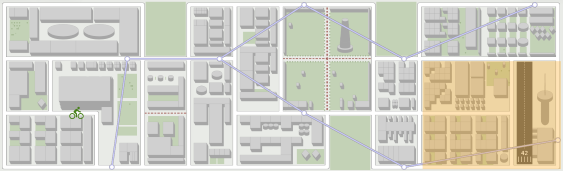

# La MeaooMap

La MeaooMap est l'application qui vous permet de visualier le terrain de jeu dans lequel votre agent va évoluer. Vous pouvez y accéder sur `http://control-tower.[NAMESPACE].xp65.renault-digital.com/` ((remplacez `[NAMESPACE]` par votre identifiant de namespace)).

Elle est matérialisée par la [MeaooCity](city.md) dans l'espace de [démo](demo.md).

##  Moyens de transport

L'agent a à sa disposition 4 moyens de transport.

| Moyen | code technique | MeaooTime par unitè de longueur | Description |
|---|---|---|---|
| A pieds | `walk` | 00:07:00 MeaooTime | A pieds, l'agent peut emprunter toutes les routes à l'exception de la zone de l'aéroport et à condition qu'il ne soit pas dans le métro. Il peut circuler dans les deux sens sur une route. Il peut également traverser les parcs et jardins. Il peut changer de moyen de transport à tout moment. |
| En métro | `subway` | 00:04:12 MeaooTime | A métro, l'agent peut emprunter les lignes sous-terraines à condition d'être proche d'une station de métro. Il peut circuler dans les deux sens. Il peut changer de moyen de transport uniquement lorsqu'il est à une station de métro.|
| A vélo | `bike` | 00:02:00 MeaooTime | A vélo, l'agent peut emprunter toutes les routes à l'exception de la zone de l'aéroport et à condition qu'il ne soit pas dans le métro et qu'il soit proche d'un vélo en free floating. Il peut circuler dans les deux sens sur une route. Il peut changer de moyen de transport à tout moment. |
| En voiture | `car` | 00:01:00 MeaooTime | En voiture, l'agent peut se déplacer sur toutes les routes à condition qu'une voiture soit proche de lui. A défaut, il peut en appeler une pour venir le chercher. Les routes sont à sens unique. Il peut changer de moyen de transport à tout moment.|

Pour effectuer un déplacement, utiliser la [commande de déplacement](command.md#move).

##  Système de coordonnées

Les coordonnées dans la MeaooCity sont définies par un plan orthonormé exprimé en coordonnées cartésiennes `x` et `y`, l'origine (0,0) se trouve dans le coin en bas à gauche de la ville:

Les unités utilisées sont exprimées en mètres et correspondent à la localisation exacte dans la MeaooCity visible dans l'espace de démo.

## L'environnement technique

Un environnement complet est à mis à votre disposition à votre arrivée.

> **PENSEZ-Y** : Prévoyez de pouvoir changer les informations de connexion à l'écosystème lors de vos développements, à savoir les URLs de connexion aux APIs et l'adresse et les credentials du broker de message. Vous pourrez ainsi facilement passer de votre environnement de développement à l'environnement de [démo/test](demo.md).
